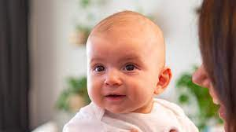
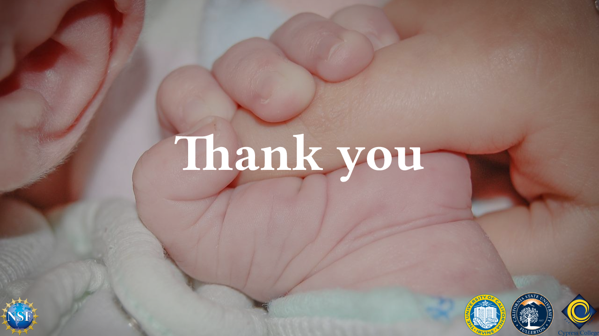

```{r xaringan-themer, include=FALSE, warning=FALSE}
library(xaringanthemer)
style_mono_accent(
  base_color = "hotpink",
  header_font_google = google_font("Josefin Sans"),
  text_font_google   = google_font("Montserrat", "300", "300i"),
  code_font_google   = google_font("Fira Mono")
)
```
### Scientific Goals 

<p align="center">
  
</p>


__NICHD:__ 
* Understand the impact of media habit on children language and social emotional
skills development

__PI:__
* Rigorously test whether a book intervention has enough significant evidence to
improve child development outcomes for infants from diverse 
families and circumstances

__Team 3:__
* Statistically model how media and its uses (e.g. smartphones, tablets, ereaders) 
affect key developmental attributes in infants

---
### Study Design

--
* Part of BB2 project whose aim is to find low cost methods to improve
child development
--


* BB1 yielded results such as improved language skills and fewer injuries
among children
--


* Extending the research to be more diverse in the form of farther inclusion
as well as different languages.
--


* Potentially challenged by the fact that TV and mobile devices are in almost every U.S. home
--


* Promotes literacy as well as one-on-one time 

--


.pull-left[
* Four groups of data: 
  * mother book only
  * father book only
  * co-parent
  * commercial book]
  .pull-right[
  ]

---
### Data Structure 

--


* Some Variables 
--


  * child-id and parent-id
--


  * wave
--


  * preg-plan
  <p align="next">
  
</p>
--


* Sample size is 210 children and there are many variables
---
### Data Collection Approaches
--

* 420 first-time, heterosexual parents living in the same household (210 children at 9 months old)

--

* family income below $70,000 from OC and Washington DC area

--

* Data gathered through:

  * home visits at 9, 18, 24, and 30 months

  * phone interviews at 12, 15, and 21 months

--

* Resulting in 7 points of longitudinal data for analysis


---
